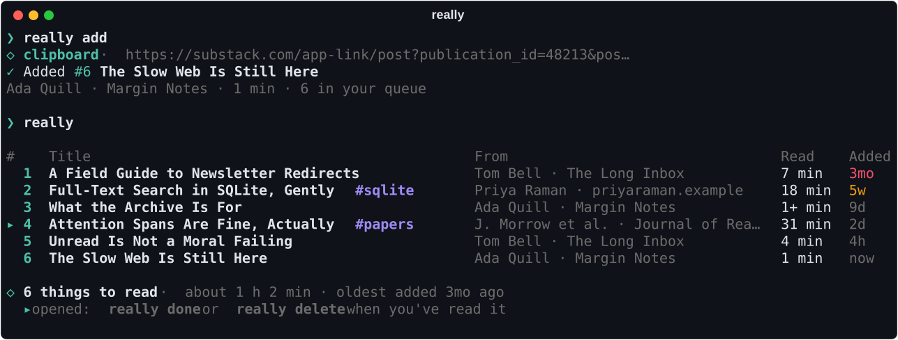
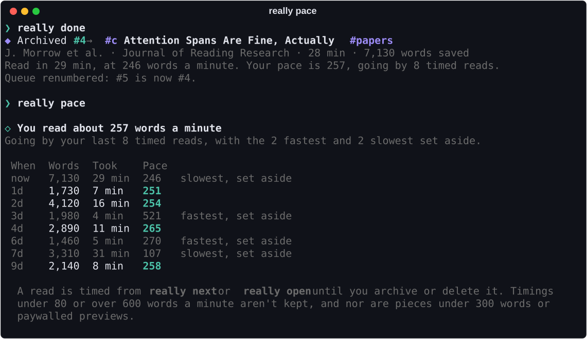
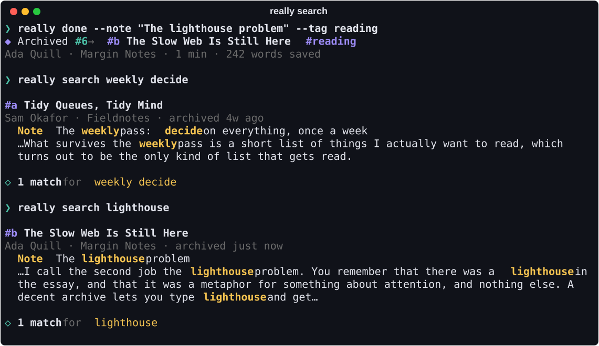

<h1 align="center">really</h1>

<p align="center">
  <b>A reading list that remembers what you read.</b><br>
  Copy a link, run <code>really add</code>, and read it when you have time. Archive the ones worth
  keeping, and search their full text months later.
</p>

<p align="center">
  <a href="https://github.com/adamtrain/really/actions/workflows/ci.yml"></a>
  
  <a href="https://github.com/astral-sh/uv"></a>
  <a href="https://github.com/astral-sh/ruff"></a>
  <a href="LICENSE"></a>
</p>

<p align="center">
  
</p>

## Why really

- **One place for links.** Whether it came from a newsletter, a chat or an open tab, it goes in
  the same queue, and that queue is one command away.
- **Two words to save something.** `really add` takes the link on your clipboard. Arguments and
  pipes work too.
- **Newsletter links, untangled.** really follows click-trackers and redirects to the article
  itself and drops the tracking parameters, so a post has one address however you came by it.
  Substack's emailed, shared and in-app links all land on the same clean URL.
- **It knows what it's holding.** Title, author, publication and length are worked out from the
  page.
- **Reading times that are yours.** really times how long things actually take you and bases
  its estimates on your pace, not an average reader's.
- **A queue you can get through.** `really next 15` opens something you can read in fifteen
  minutes. `really review` walks you through a backlog one decision at a time. Things that have
  waited too long change color.
- **An archive you can search.** Archive an article and its full text is kept, stripped of
  navigation, subscribe boxes and comments. Find it again by anything it said.
- **Yours.** Everything is one SQLite file on your disk. Export it to Markdown or JSON whenever
  you like.

## Install

You'll need [uv](https://docs.astral.sh/uv/).

```sh
uv tool install git+https://github.com/adamtrain/really
```

That puts `really` on your `PATH`. To hack on it, clone the repo and install it in editable mode,
so your changes take effect right away:

```sh
git clone https://github.com/adamtrain/really && cd really
uv tool install --editable .
```

There's nothing to configure. Your list is created the first time you add to it.

## Usage

```sh
really add                 # queue the link on your clipboard
really                     # see what's waiting
really next                # open the one that's waited longest
really next 15             # …or something you can read in 15 minutes
really archive             # done reading: keep it, full text and all
really delete              # done reading: don't
really search lighthouse   # find it again, months later
```

A link is in one of two places. It starts in your **queue**. Once you've read it, you either
`archive` it, which keeps it for good and makes it searchable, or `delete` it.

Commands that act on one item take an id (`7`), a URL, or a few words from the title
(`really open slow web`). `archive`, `delete` and `paste` can go without: they act on whatever
you last opened with `really next` or `really open`, which is usually what you've just finished
reading.

## Getting links in

really adds the first of these that applies:

1. Arguments: `really add https://…`, or just `really https://…`
2. Piped or redirected stdin: `pbpaste | really add`, `really add < links.txt`
3. The clipboard: `pbpaste` on macOS; `wl-paste`, `xclip` or `xsel` on Linux; PowerShell on
   Windows

The text doesn't have to be a bare URL. really pulls the links out of whatever it's given, so
you can copy a whole paragraph of an email. If your clipboard holds several, it lists them and
asks before adding them all.

Each link is fetched once to learn its title, author and length, and to find out where it really
leads. If the page can't be reached, the link is queued anyway and `really refresh` fills in
the rest later. `--offline` skips the fetch, and `-t` tags as you add:

```sh
really add -t papers https://arxiv.org/abs/1706.03762
```

To save a link without opening a terminal, bind `really add` in anything that can run a shell
command, such as Raycast, Alfred, or a Shortcuts *Run Shell Script* action. Launchers don't load
your shell profile, so give them the full path (`~/.local/bin/really add`).

### Coming from Safari's Reading List

```sh
really import safari --dry-run   # see what would come across
really import safari             # bring over everything you haven't read
really refresh                   # fetch authors, reading times and text
```

Titles and the dates you saved things come along. Items Safari says you've read are skipped
unless you pass `--read queue` or `--read archive`. Safari's own list is left untouched. macOS
guards Safari's files, so your terminal app needs Full Disk Access (System Settings → Privacy &
Security) for this one command.

## Working through the queue

| | |
| --- | --- |
| **#** | The id you refer to an item by. A `▸` marks ones you've opened but not yet archived or deleted. |
| **From** | Who wrote it and where, as far as the page says. |
| **Read** | How long it will take you, at [your pace](#reading-times-that-fit-you), not counting footnotes. A `+` means at least that: the post is paywalled and only its preview could be read. |
| **Added** | How long it's been waiting. Amber after 30 days, red after 90. |

The queue is listed oldest first, and `really next` opens the one at the top. Give it a number
of minutes to get something that fits the time you have, `--random` to be surprised, or `--peek`
to see what's next without opening it.

When the list has got away from you, `really review` shows each item in turn and asks whether to
open, archive, delete or skip it.

### Reading times that fit you

<p align="center">
  
</p>

Reading times start out assuming 230 words a minute. From then on really measures you: a read is
timed from `really next` or `really open` until you archive or delete it, and once five have
been timed, every reading time is worked out from your own pace. It keeps adjusting as you read.

Timing what people really do means some of the timings are wrong, so:

- **A timing is only kept if it could have been one sitting**: between 80 and 600 words a
  minute. Leave a tab open over lunch, or archive something after a glance, and nothing is
  recorded.
- **Some things aren't timed at all**: pieces under 300 words, where the seconds spent switching
  windows are too much of the total, and paywalled previews, whose length isn't the length of
  what you read.
- **The fastest and slowest are set aside.** Of your last 50 timed reads, the fastest fifth and
  the slowest fifth are left out, and your pace is the total words over the total time of the
  rest.

`really pace` shows the figure and the reads behind it.

## Archive and search

<p align="center">
  
</p>

```sh
really archive --note "The lighthouse problem" -t reading
really search lighthouse
really show slow web          # read your saved copy in the terminal
really list --archive
```

Search covers titles, authors, publications, tags, your notes and the full text, and puts the
best matches first.

| You type | It finds |
| --- | --- |
| `bitter lesson` | Things containing both words. Word endings don't matter (`run` finds *running*), nor do accents. |
| `"bitter lesson"` | That exact phrase. |
| `comput*` | Anything starting that way. |
| `author:sutton` | A match in one field. Also `title:`, `site:`, `tag:`, `note:` and `text:`. |

A note is worth adding when you archive something: it's searchable, and it's where you can
record why the piece mattered in words you'll actually think to search for.

`really export ~/notes/reading` writes each archived article as a Markdown file with YAML front
matter, ready for Obsidian or a git repo. `really export --json` prints everything, queue
included.

## Substack and paywalls

Substack is the case really is tested hardest against. The link in a Substack email
(`substack.com/app-link/post?…`), a share link (`open.substack.com/pub/…`), a link from the app
(`substack.com/home/post/p-…`) and the post's address on the publication's own domain all
resolve to the same canonical URL, with the publication's name, the author and the date read
from the post's metadata. So does the comment button in an email, which on its own would open a
page of comments with no post in it.

Comments are never saved. Footnotes are, and they're searchable, but they don't add to the
reading time, which keeps really's word counts within a few percent of the ones Substack
reports for its own posts.

Paywalled posts say so in that metadata, and really takes them at their word: the item is marked
as a preview, and you're told when you add and when you archive it. If you subscribe, you can
keep the whole thing. Open the post in your browser, select the text and copy it, then:

```sh
really paste        # the clipboard's text becomes your saved copy
```

The same goes for anything else your browser can read and really can't, such as pages behind a
login.

## Commands

| Command | |
| --- | --- |
| `really` | Show your queue |
| `really add [LINKS]…` | Queue links from your clipboard, arguments or stdin |
| `really list` | The queue; `--archive` or `--all` for the rest. Filter with `-t TAG`, order with `--sort added\|length\|title` |
| `really next [MINUTES]` | Open the next thing to read |
| `really open ITEM` | Open a particular one |
| `really review` | Go through the queue one by one |
| `really pace` | How fast you read, and the timed reads that says so |
| `really archive [ITEM]` | Keep something, with an optional `--note` and tags |
| `really delete [ITEMS]…` | Forget something. Asks first if it's in the archive |
| `really search WORDS…` | Full-text search; `--archive` or `--queue` to narrow it |
| `really show ITEM` | Read the saved copy. Piped, it prints plain Markdown |
| `really requeue ITEM` | Move something from the archive back to the queue |
| `really tag ITEM [TAGS]…` | Add tags, or `--remove` them |
| `really edit ITEM` | Correct the `--title`, `--author`, `--site` or `--published` date, or change your `--note` |
| `really paste [ITEM]` | Use the clipboard's text as the saved copy |
| `really refresh [ITEMS]…` | Fetch pages again. With no items, everything that has no saved copy; `--all` for the lot |
| `really import safari` | Bring in Safari's Reading List |
| `really export [DIR]` | Write the archive as Markdown files, or `--json` for everything |
| `really stats` | Counts, reading time, and where your list is stored |

`list`, `search` and `show` take `--json` for scripts. Results go to stdout; progress and errors
go to stderr. really exits with `0` when it's done what you asked and `1` when it couldn't.

Your list is one file: `~/Library/Application Support/really/really.db` on macOS,
`~/.local/share/really/really.db` on Linux. To keep it somewhere else, set `REALLY_DB` to a file
or a folder, in your shell profile:

```sh
export REALLY_DB=~/Documents/reading
```

To take an existing list with you, move the file there. Anything that runs `really` outside your
shell, like a launcher, needs the variable too, or it will start a second list in the default
place.

## How it works

Pages are fetched with [httpx](https://www.python-httpx.org). Besides ordinary redirects, really
follows the small forwarding pages that newsletter platforms use in place of one, and it won't
mistake a login wall it got bounced to for the article. A page's own `<link rel="canonical">` is
trusted only when it names the same page without the query string, because that is exactly what
strips a newsletter's tracking and because sites get canonical links wrong in every other way.

[trafilatura](https://trafilatura.readthedocs.io) finds the article in the page. really keeps two
copies: Markdown with the links intact, which is what you read and export, and plain text, which
is what gets searched. PDFs are read with [pypdf](https://pypdf.readthedocs.io). Publication
dates are only taken from a page's metadata, never guessed from dates that appear in the text.

The copy is saved when you add a link, not when you archive it. That's where the reading time
comes from, and it means archiving works offline and survives the page being taken down in the
meantime. Fetching a page again only replaces your copy with one that's as good: never with a
paywalled preview, or with what's left of a page that has since lost its text. Deleting an item
deletes its copy.

Everything lives in SQLite, with an [FTS5](https://www.sqlite.org/fts5.html) index kept in step
by triggers. Results are ranked with BM25, weighted so a match in a title, tag or note counts
for more than one in the body.

What's inferred can be wrong. A page with no byline has no author, and a page that only renders
with JavaScript has no text. `really edit` fixes the former and `really paste` the latter.

## Development

```sh
uv sync                         # set up the environment
uv run pytest                   # run the tests
uv run ruff check . && uv run ruff format .
uv run ty check                 # type-check
uv run scripts/screenshots.py   # regenerate docs/*.svg
uv run scripts/wordcounts.py https://example.substack.com   # compare counts with Substack's
```

The tests never touch the network: pages come from `tests/fixtures/`, served through httpx's
mock transport. The screenshots are rendered from those same fixtures, through the code really
uses for a real list. `wordcounts.py` is the exception: it reads a publication's latest free
posts live and checks really's word count for each against the one Substack reports.

```
src/really/
├── cli.py        # the commands, and working out which links you mean
├── clipboard.py  # cross-platform clipboard reading
├── urls.py       # finding links in text and cleaning them up
├── fetch.py      # downloading a page, redirects and all
├── extract.py    # title, author and article text from HTML and PDFs
├── store.py      # the SQLite file and its full-text index
├── pace.py       # working out your reading speed from timed reads
├── safari.py     # reading Safari's Reading List
├── export.py     # Markdown and JSON export
└── render.py     # everything you see
```

## License

[CC0 1.0](LICENSE). really is dedicated to the public domain.

really is an independent project and isn't affiliated with or endorsed by Substack or Apple.
